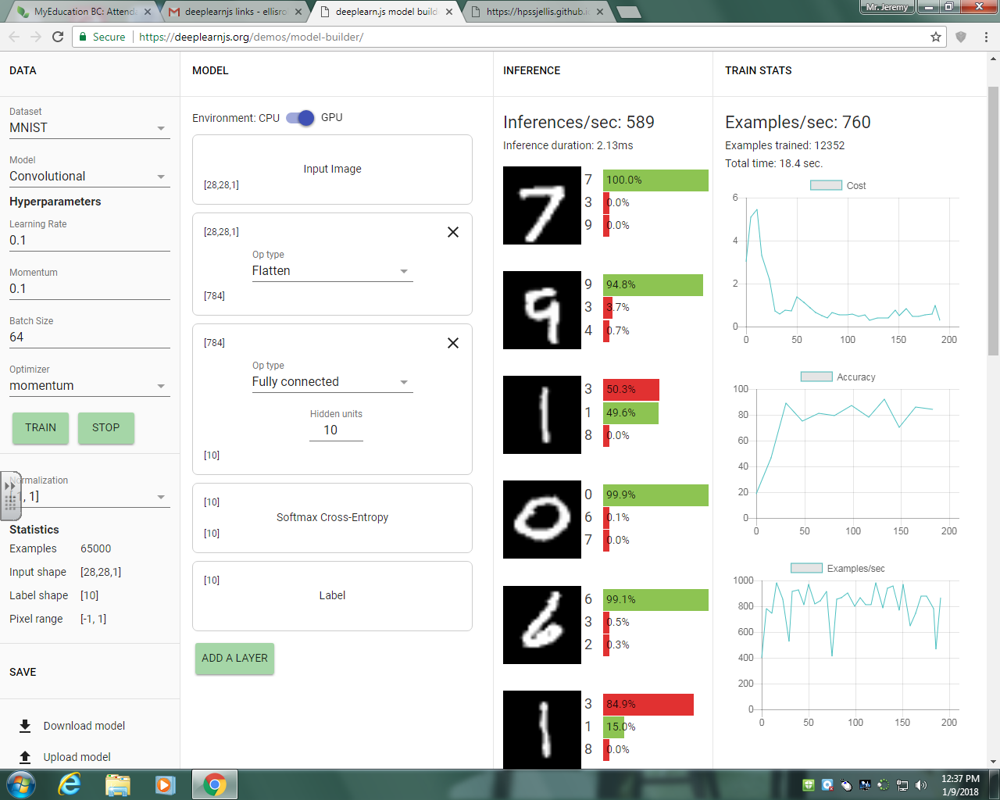
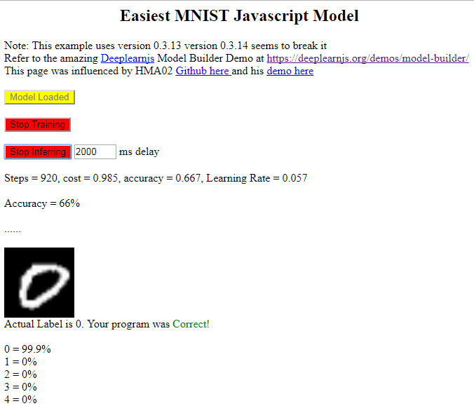

Version 2 of the mymodel.html  Easiest MNIST

The actual webpage for this version is at 

https://hpssjellis.github.io/deeplearnjs-javascript-examples/Unordered-javascript-examples/deeplearnjs-examples/mymodel2/myModel.html

This is my version of the model-builder by deeplearnjs at

https://deeplearnjs.org/demos/model-builder/

## The plan is to simplify the Model Builder so that the Javascript code is easy enough for an average javascript Programmer to understand.

Here is an image of the the original model builder

**********************************************************************************

**********************************************************************************

And here is an image of this site showing only the basics for the model builder

**********************************************************************************

**********************************************************************************

## Present problem:

The Original Model Build has been programmed to load information from a .json file (which is awesome and flexible) but makes the javascript code a bit too complex for these tutorials.

Ideally I would like to make a single function that loads the original MNIST dataset and possibly a different function that loads the CSV version of the MINST dataset. That would make this program a viable teaching framework for Javascript programmers that are not Machine Learning experts.

Any help will be mentioned in the credits for the final youtube video tutorial.

.

.

.

.

Further work was done by HMA02 to simplify the model at this demo

https://hma02.github.io/deeplearnjs-practice/deeplearn_mnist_starter.html

and his github is here

https://github.com/hma02/deeplearnjs-practice

